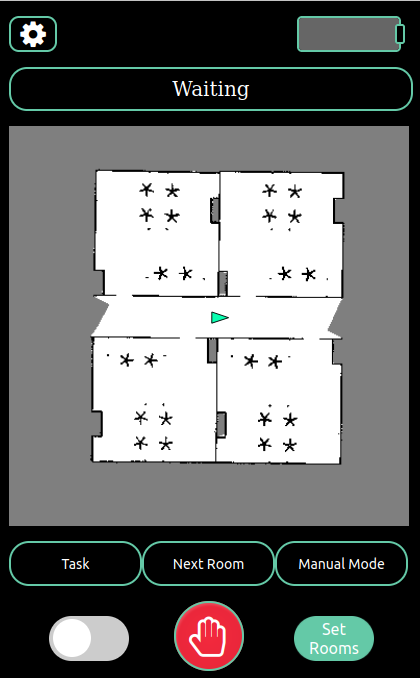

# Web server 

Package for the user interface of the Assisted Cleaning Solution robot.

## Launch website 

Go to directory where the index file is stored and there run:

    python3 -m http.server 7000;

Then go to the firefox browser to the site http://localhost:7000/

## Customization

### Change floorplan 

1. Go to view.js. 
2. Change the value of the variable floorplanImage to the location of the new image.

### Change number of rooms

1. Go to set_room.js. 
2. Change the array of the variable possibleRooms to an array list containing all the numbers of the rooms.

### Add language

1. Go to setting.html.
2. Add an extra line for the button. Like the other languages. 
3. Go to the language folder.
4. Copy existing file and change the name to the new language.
5. Translate the second column in the new language.

### Change url of site for ros connection

1. Go to files battery.js, manual_mode.js, obstacle.js, robot_on_map and task_msg.js.
2. Change the value after url between the apostrophes. In a similar function as shown below. 

        var ros = new ROSLIB.Ros({
            url : 'ws://localhost:9090'
        });

### Change ros topics

1. Go to files battery.js, manual_mode.js, obstacle.js, robot_on_map and task_msg.js.
2. Change the message.
    1. Change the topics name and or messageType. In a similar function like this:

            var cmdVel = new ROSLIB.Topic({
                ros: ros,
                name: '/cmd_vel',
                messageType: 'geometry_msgs/Twist'
            })
    2. Change the datatype. In a similar function like this:

            poseTopic.subscribe(function(message) {
                console.log('In pose subscribe callback');

                var now = new Date();
                var position = 'x: ' + message.pose.pose.position.x
                    + ', y: ' + message.pose.pose.position.y
                    + ', z: 0.0';
                var orientation = 'x: ' + message.pose.pose.orientation.x
                    + ', y: ' + message.pose.pose.orientation.y
                    + ', z: ' + message.pose.pose.orientation.z
                    + ', w: ' + message.pose.pose.orientation.w;
            });

## Images

Images of the site are included in the images_site folder.

Index page.

Setting menu reached by pressing the setting button on index page.

Manual mode menu reached by pressing the manual mode button on index page.

Set rooms menu reached by pressing the Set Rooms button on index page.

Task menu reached by pressing the Task button on index page.

Unknown Object menu appears after the robot receives a message during the task clean plinths.

